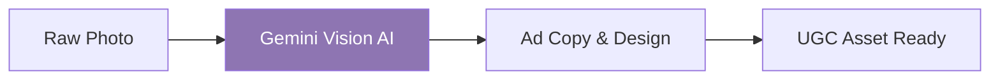

# 📸 NBGC - Next-Gen Content

A high-efficiency automation pipeline that transforms raw product photos into high-converting User-Generated Content (UGC) ads using Vision AI.

## 🌊 The Workflow

🚀 Key Features
Vision AI Analysis: Uses Gemini to analyze product context and ad hooks.

Automated Ad Copy: Generates persuasive text based on visual data.

Scale for Agencies: Built for marketing agencies needing thousands of unique assets.

🛠️ Tech Stack
Engine:

Vision AI:

Infrastructure:
