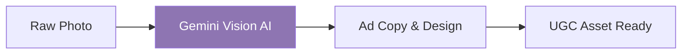

### 📸 NBGC - Next-Gen Content (Photos to UGC Ads)

*A high-efficiency automation pipeline that transforms raw product photos into high-converting UGC ads using AI.*

## 🌊 The Workflow

## 🚀 Key Features
**Vision AI Analysis:** Uses Gemini to analyze product context and ad hooks.

**Automated Ad Copy:** Generates persuasive text based on visual data.

**Scale for Agencies:** Built for marketing agencies needing thousands of unique assets.

## 🛠️ Tech Stack

Engine: 

Vision AI: 

Infrastructure: 

- **Impact:** Automated asset creation for marketing agencies.

- **Status:** [Live Demo](https://nbgc.pages.dev/) 

